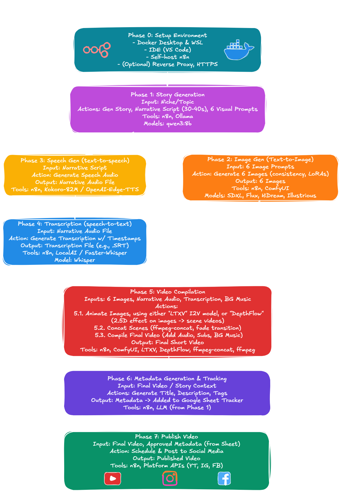

# AI-Powered Short Video Automation for Social Media

## Overview
This guide demonstrates how to automate the creation of short-form videos for social media using self-hosted AI Models and open-source tools. The system leverages n8n for workflow automation, combining various AI models and tools to create engaging content efficiently.

*Figure 1: Visual representation of the AI video automation process, showing the flow between different phases and their relationships.*

## Getting Started
Follow the [Phase 0 - Selfhosting n8n](phase-0-selfhosting-n8n.md) to set up the environment:
- **Docker & WSL Setup**
  - Install and configure Docker Desktop
  - Set up Windows Subsystem for Linux (WSL)
  - Configure NVIDIA drivers for GPU acceleration
- **Development Environment**
  - Configure your preferred IDE
  - Self-host n8n for workflow automation
- **Selfhost n8n**
  - create n8n docker compose file
  - run and access n8n
- **Optional Enhancements**
  - Set up reverse proxy
  - Configure HTTPS certificates

## Process Overview
The entire workflow is automated using n8n workflows, consisting of seven key phases:

### Phase 1 - Story Generation
Creating engaging narratives and visual concepts using LLMs tailored to a specific niche.
- **Input:** Niche/topic selection
- **Outputs:**
  - Engaging short story
  - 30-40 second narrative script
  - 6 visual scene prompts
- **Tools:**
  - LocalAI: All-in-one solution with multiple runtime engines
  - Ollama: Fast LLM runtime engine
- **Recommended Models:**
  - llama3.1:8b
  - qwen2.5:14b

### Phase 2: Image Generation
Transforming text prompts into consistent, high-quality visuals that align with the narrative.
- **Input:** 6 visual scene prompts
- **Output:** 6 consistent, high-quality images
- **Tools:**
  - LocalAI: StableDiffusion and Flux support
  - ComfyUI: Extensible platform with broad model support
- **Model Options:**
  - SDXL1.0: High-quality, general-purpose generation
  - Flux: Specialized for artistic styles
  - Illustrious: Optimized for character consistency

### Phase 3: Speech Generation
Converting written scripts into natural-sounding narration using text-to-speech models.
- **Input:** Narrative script
- **Output:** High-quality speech audio
- **Tools & Models:**
  - Kokoro-82M: Lightweight, high-quality TTS with multiple voices
  - OpenAI-Edge-TTS: Local, OpenAI-compatible TTS solution

### Phase 4: Transcription
Creating accurate timestamped text from audio to enable subtitle generation and content indexing.
- **Input:** Speech audio
- **Output:** Timestamped transcription
- **Tools:**
  - LocalAI
  - Faster-whisper
- **Model:** Whisper (OpenAI's speech recognition model)

### Phase 5: Video Compilation
Assembling all generated assets into a polished video with professional visual effects and audio.
- **Inputs:**
  - 6 generated images
  - Narrative audio
  - Transcription
  - Background music
- **Process:**
  1. Apply DepthFlow 2.5D effects to images
  2. Convert scenes to video with proper timing
  3. Concatenate scenes with fade transitions
  4. Add audio, subtitles, and background music
- **Tools:**
  - DepthFlow
  - ffmpeg-concat
  - ffmpeg

### Phase 6: Metadata & Tracking
Creating discoverable content by generating optimized metadata and maintaining a content library.
- Generate video title, description, and tags
- Add to Google Sheets tracker for review
- Review and approve which videos should be posted

### Phase 7: Publishing
Automating the distribution of content across various social media platforms on a schedule.
- Schedule and publish to social platforms
- Supported platforms:
  - YouTube
  - Instagram
  - Facebook

## Key Benefits
- **Quality Control:** Consistent output through controlled processes
- **Cost-Effective:** Uses free, self-hosted, and open-source tools
- **Customizable:** Flexible workflow that can be adapted to specific needs
- **Scalable:** Automated process for regular content creation
- **Privacy-Focused:** All processing done locally
- **Extensible:** Easy to add new models and tools

## Future Enhancements
- Enhance I2V results once new opensource video models came out.
- Support for additional social media platforms