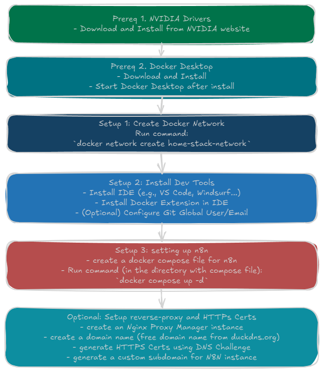

# HomeStack - Selfhosting n8n

## Choosing a Workflow Automation Solution

There are many ways to achieve automation in a HomeStack environment. This guide focuses on workflow engines as they provide a perfect balance between power and usability, allowing for complex automation pipelines while maintaining flexibility and control.

After testing several open-source, self-hostable solutions, two options stand out:

1. **[n8n](https://github.com/n8n-io/n8n)**
   - Highly extensible and customizable
   - Extensive node library and integration options
   - Strong community support
   - Robust error handling and debugging capabilities
   - Active development with rapid feature additions, like the recent additions of MCP (Model Context Protocol) support

2. **[ActivePieces](https://github.com/activepieces/activepieces)**
   - User-friendly interface with modern design
   - Promising new solution with active and fast development
   - Currently lacks the level of extensibility that n8n offers
   - Developers are responsive and continuously improving the platform

This guide focuses on n8n as it currently offers the best balance of features, extensibility, and active development for this use case. However, ActivePieces shows great promise for the future and may be worth considering for simpler workflows.



*Figure 2: Detailed flow diagram showing the step-by-step process to selfhost n8n*

## Prerequisites

Before beginning, the following components should be installed and configured:

1. **NVIDIA Drivers** (if using GPU acceleration)
   - NVIDIA drivers should be installed on Windows
   - Available from [NVIDIA's website](https://www.nvidia.com/Download/index.aspx)

2. **Docker Desktop**
   - Download and install [Docker Desktop](https://www.docker.com/products/docker-desktop)
   - Start Docker Desktop after installation

3. **WSL 2 (Windows Subsystem for Linux)**
   - Enable WSL 2 in Windows:
     ```powershell
     wsl --install
     wsl --set-default-version 2
     ```
   - Install Ubuntu from the Microsoft Store:
     ```powershell
     wsl --install -d Ubuntu
     ```
   - Configure Ubuntu in Docker Desktop settings:
     - Open Docker Desktop
     - Go to Settings > Resources > WSL Integration
     - Enable integration with Ubuntu

## Setup Instructions

### 1. Create Docker Network

First, create a custom network for the HomeStack services:

```bash
docker network create home-stack-network
```

### 2. Install Development Tools

1. Install Visual Studio Code (or Windsurf, Cursor, or another preferred IDE)
   - Download from [VS Code website](https://code.visualstudio.com/)
   - Install Docker Extension
2. Install the Docker extension
3. (Optional) Connect to GitHub for config synchronization:
   ```bash
   git config --global user.name "Your Name"
   git config --global user.email "your.email@example.com"
   ```

### 3. Configure n8n

Create a `docker-compose.yml` file with the following configuration:

```yaml
services:
   n8n:
    image: docker.n8n.io/n8nio/n8n
    container_name: n8n
    environment:
      # Basic Config
      N8N_HOST: n8n.example.com  #Replace with actual domain or IP
      N8N_PORT: 5678
      N8N_PROTOCOL: https
      NODE_ENV: production
      WEBHOOK_URL: https://n8n.example.com  #Replace with actual domain or IP
      GENERIC_TIMEZONE: Europe/Paris  # Adjust to local timezone
      # Tuning
      N8N_PAYLOAD_SIZE_MAX: 250 #Increase payload size to 250MB from default 16MB
      N8N_DEFAULT_BINARY_DATA_MODE: filesystem #Bypass issues with uploading large files to Google Drive
      N8N_RUNNERS_ENABLED: true #Enable the execution of user-provided JavaScript Code
      NODE_FUNCTION_ALLOW_BUILTIN: "*" #Allow Code node to import modules
      NODE_FUNCTION_ALLOW_EXTERNAL: "*" #Allow the use of community nodes
    ports:
      - 5678:5678
    volumes:
      - C:/HomeStack/n8n/data:/home/node/.n8n
      - C:/HomeStack/videos:/videos
    restart: unless-stopped

networks:
  default:
    external: true
    name: home-stack-network
```

### 4. Start the Service

To start n8n, run:

```bash
docker compose up -d
```

## Configuration Notes

- The configuration includes several optimizations:
  - Increased payload size limit to 250MB
  - Filesystem-based binary data handling
  - Enabled JavaScript code execution
  - Allowed module imports and community nodes

## Accessing n8n

Once the service is running, the n8n web interface is accessible at:
- http://localhost:5678

## (Optional) Enhanced Setup with Reverse Proxy and HTTPS

This section guides through setting up secure, HTTPS-enabled access to an n8n instance using Nginx Proxy Manager and DuckDNS. This setup provides:
- Secure HTTPS access
- Custom domain name
- Easy certificate management
- Professional-looking URLs

### 1. Setting up Nginx Proxy Manager with Docker Compose

1. Create a new directory for Nginx Proxy Manager:
```bash
mkdir nginx-proxy-manager
cd nginx-proxy-manager
```

2. Create a `docker-compose.yml` file with the following content:
```yaml
version: '3'
services:
  npm:
    image: 'jc21/nginx-proxy-manager:latest'
    container_name: npm
    ports:
      - '80:80'
      - '81:81'
      - '443:443'
    volumes:
      - C:/HomeStack/npm/data:/data
      - C:/HomeStack/npm/letsencrypt:/etc/letsencrypt
    restart: unless-stopped
```

3. Start the Nginx Proxy Manager:
```bash
docker-compose up -d
```

4. Access the admin interface at `http://server-ip:81`
   - Default login: admin@example.com
   - Default password: changeme
   - Change these credentials immediately after first login

### 2. Setting up DuckDNS for Dynamic DNS

1. Create a DuckDNS account:
   - Visit https://www.duckdns.org/
   - Sign in with a preferred authentication method
   - Create a new subdomain (e.g., `example.duckdns.org`)

2. Note the DuckDNS token:
   - After creating a subdomain, the token will be displayed
   - Save this token securely

3. Update the domain to point to the local IP: 
   - In the DuckDNS interface, add the local IP address
   - Example: If the local IP is 192.168.1.1, add it to the IP field
   - Click "Save" to update the DNS record

### 3. Configuring Nginx Proxy Manager with DuckDNS

1. Add a new proxy host in Nginx Proxy Manager:
   - Log in to the Nginx Proxy Manager interface
   - Click "Proxy Hosts" → "Add Proxy Host"
   - Fill in the following details:
     - Domain Names: n8n.example.duckdns.org
     - Scheme: http
     - Forward Hostname/IP: n8n-container-name
     - Forward Port: 5678 (default n8n port)
     - Block Common Exploits: Enabled
     - Websockets Support: Enabled

2. Set up SSL certificate:
   - In the SSL tab of the proxy host configuration
   - Select "Request a new SSL Certificate"
   - Choose "DNS Challenge"
   - Select "DuckDNS" as the provider
   - Enter the DuckDNS token
   - Enable "Force SSL" and "HTTP/2 Support"
   - Click "Save" to request the certificate

3. Certificate renewal configuration:
   - Nginx Proxy Manager handles certificate renewal automatically
   - Certificates are valid for 90 days
   - Renewal occurs automatically 30 days before expiration

### 4. Testing and Verification

1. Verify HTTPS access:
   - Visit https://n8n.example.duckdns.org
   - A secure connection with a valid certificate should appear
   - The browser should display a lock icon

2. Verify n8n access:
   - Access the n8n instance through the new domain
   - All connections should be secure (HTTPS)

### 5. Maintenance and Troubleshooting

1. Regular maintenance:
   - Monitor certificate expiration dates
   - Keep Nginx Proxy Manager updated
   - Check DuckDNS IP updates

2. Common issues and solutions:
   - If the domain doesn't resolve:
     - Verify the DuckDNS IP is correct
     - Check DNS propagation (can take up to 24 hours)
   - If SSL certificate fails:
     - Verify DuckDNS token validity
     - Check domain ownership
     - Review firewall settings

3. Security considerations:
   - Keep the DuckDNS token secure
   - Regularly update Nginx Proxy Manager
   - Monitor access logs for suspicious activity
   - Consider implementing fail2ban for additional security

This setup provides a professional, secure way to access an n8n instance from anywhere while maintaining security and ease of use.

## Troubleshooting

For common issues:

1. Check Docker Desktop is running:
   ```bash
   docker info
   ```

2. Verify WSL 2 is properly configured:
   ```powershell
   wsl --status
   ```

3. Ensure the network `home-stack-network` exists:
   ```bash
   docker network ls
   ```

4. Check container logs:
   ```bash
   docker compose logs n8n
   ```

5. Check container status:
   ```bash
   docker compose ps
   ```

## Maintenance

To stop the service:
```bash
docker compose down
```

To update n8n:
```bash
docker compose pull
docker compose up -d
```

To view running containers:
```bash
docker compose ps
```

To restart the service:
```bash
docker compose restart
``` 
