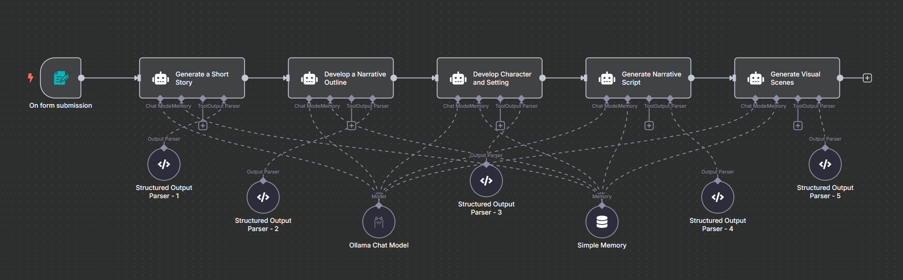
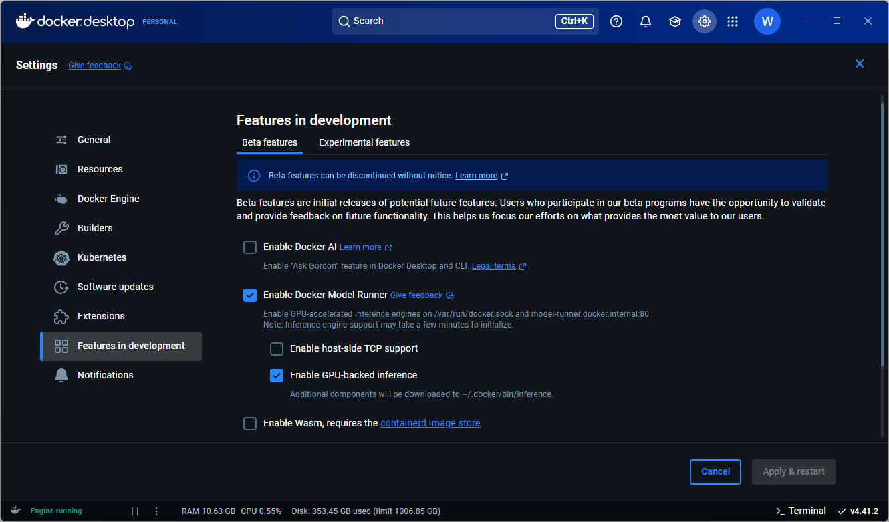

# Text Generation



## Why Run LLMs Locally?

**Benefits:**
- **Privacy:** Keep our data on our machine.
- **Cost-Effective:** No API costs for inference.
- **Offline Access:** Run models without an internet connection.
- **Customization:** More control over the inference process.
- **Learning:** Understand the behind the scenes of LLMs inference.

## LLM Runtime Engines

LLM Runtime engines are specialized software frameworks designed to efficiently load, manage, and run large language models. Think of them as the software that allows our computer's hardware (CPU/GPU) to efficiently run the complex calculations of an LLM.

Key functions include:
- Optimizing inference performance
- Reducing memory requirements
- Providing APIs for applications to interact with models
- Managing model loading and unloading
- Handling batching and throughput optimization

## Core Inference Libraries
### & Their Front‑End Tools

- **Inference Libraries:**
    - **[llama.cpp](https://github.com/ggml-org/llama.cpp)**: A pure C/C++ GGML‑based runtime for LLM inference on CPU/GPU with minimal dependencies.
            
    - **[vLLM](https://docs.vllm.ai/?utm_source=chatgpt.com)**: A high‑throughput, Python‑based serving engine using PagedAttention for efficient GPU inference .

    - **[MLX](https://github.com/ml-explore/mlx)**: Apple’s NumPy‑style array framework with GPU acceleration on M‑series chips, enabling on‑device LLM inference via community wrappers.

- **Front‑End Tools:**
    - **[Ollama](https://ollama.com)**: A beginner-friendly LLM runtime engine, based on llama.cpp, that offers OpenAI compatible APIs, simple models management, auto model auto swapping.
    - **[Docker Model Runner](https://docs.docker.com/model-runner)**: Beta feature on Docker Desktop leveraging llama.cpp inference directly using docker commands, and docker compose.
    - **[Jan](https://jan.ai/docs)**: An AI chat application, based on llama.cpp, that offers OpenAI compatible APIs, and can integrate with cloud ai engines (Gemini, ChatGPT, OpenRouter...)

## Getting Started with Ollama

#### Using Windows Installer
1. Download and install [Ollama](https://ollama.com/download/windows).
2. After installation, we can access Ollama through the command line or use the REST API.

### Installation Options 

#### Using Windows Installer
1. Download and install Ollama from https://ollama.com/download/windows
2. After installation, you can access Ollama through the command line or use the REST API

#### Using Docker
For users who prefer containerized applications, especially when running on systems with GPU support:

```yaml 
services:
  ollama:
    image: ollama/ollama:latest
    container_name: ollama
    environment:
      - NVIDIA_VISIBLE_DEVICES=all
      - NVIDIA_DRIVER_CAPABILITIES=compute,utility
      - CUDA_VISIBLE_DEVICES=0
      - LOG_LEVEL=debug
    # ports:
    #   - 11434:11434
    volumes:
      - ollama:/root/.ollama
    deploy:
      resources:
        reservations:
          devices:
            - driver: nvidia
              count: all
              capabilities: [gpu]
    restart: unless-stopped

volumes:
  ollama:
```

> **Important Note**: When using Docker Desktop on Windows with WSL, avoid using Windows filesystem to mount the models folder. This will cause significant performance penalties as Docker will need to copy models from Windows filesystem to WSL filesystem before loading them to the GPU. Either use WSL mount folders directly from Ubuntu or Docker volumes to avoid cross-filesystem copy operations.

### Using Ollama

Once installed, you can pull models and start generating text with simple commands:

Note: If you used the Windows installer, open a command prompt or PowerShell window and run the commands directly.

#### Pulling models from [ollama](https://ollama.com) and running them:

```bash
# Access the Ollama container, skip for Windows installer
docker exec -it ollama /bin/bash

# Pull a model
ollama pull qwen3:latest

# Generate text
ollama run qwen3:latest "Write a short story about a robot discovering emotions"

# Chat interactively
ollama run qwen3:latest

# run with verbose output
ollama run qwen3:latest --verbose
```

```bash
# List running models
ollama ps

# stop serving a model
ollama stop qwen3:latest

```

#### Pulling images from [huggingface](https://huggingface.co) (if they are available):

```bash
# Access the Ollama container, skip for Windows installer
docker exec -it ollama /bin/bash

# Pull a GGUF Quantized model from Unsloth team
ollama pull hf.co/unsloth/Qwen3-8B-GGUF:Q4_K_M

# Generate text
ollama run hf.co/unsloth/Qwen3-8B-GGUF:Q4_K_M "Write a short story about a robot discovering emotions"

# Chat interactively
ollama run hf.co/unsloth/Qwen3-8B-GGUF:Q4_K_M

# run with verbose output
ollama run hf.co/unsloth/Qwen3-8B-GGUF:Q4_K_M --verbose
```

```bash
# List available models
ollama ls

# delete a model
ollama rm hf.co/unsloth/Qwen3-8B-GGUF:Q4_K_M
```

Ollama provides a simple API that can be integrated with various applications, making it an excellent foundation for building your own AI-powered tools.

### Setting up llama.cpp

#### Use pre-built binary
Download pre-built [binary](https://github.com/ggerganov/llama.cpp/releases) from:
```text
github.com/ggerganov/llama.cpp/releases
```

Load and run the model:
```bash
./llama-server --jinja -fa -ngl 99 --host 0.0.0.0 --port 8080 -hf Qwen/Qwen3-8B-GGUF:Q4_K_M
```

#### Using Docker Compose

```yaml 
services:
  llama-cpp:
    image: ghcr.io/ggml-org/llama.cpp:server-cuda
    container_name: llama-cpp
    environment:
      LLAMA_ARG_MODEL_URL: hf.co/Qwen/Qwen3-8B-GGUF/resolve/main/Qwen3-8B-Q4_K_M.gguf # alternatively, use LLAMA_ARG_MODEL for manually downloaded models
      LLAMA_ARG_CTX_SIZE: 4096    # Context size (default: 4096, 0 = loaded from model)
      LLAMA_ARG_N_GPU_LAYERS: 99  # Number of layers to store in VRAM
      LLAMA_ARG_JINJA: true       # Enable Jinja templating (default: disabled)
      LLAMA_ARG_PORT: 8080        # Port to listen (default: 8080)
    ports:
      - 8040:8080
    volumes:
      - llama-cpp:/root/.cache/llama.cpp
    deploy:
      resources:
        reservations:
          devices:
            - driver: nvidia
              count: all
              capabilities: [gpu]
    restart: unless-stopped

volumes:
  llama-cpp:
```

### Setting up Docker Model Runner (beta)

#### Enable Docker Model Runner


#### Using Docker Commands

```yaml
# Check whether the Docker Model Runner is active
$ docker model status
$ docker model help

# Pull models
$ docker model pull ai/qwen3:latest
$ docker model pull hf.co/unsloth/Devstral-Small-2505-GGUF:Q4_K_M

# List available models
$ docker model list

# Run a model
$ docker model run ai/qwen3:latest "Hi"
```

#### Using Docker Compose

```yaml 
services:
  ai_runner:
    provider:
      type: model
      options:
        model: ai/qwen3:latest
```

### Setting up vLLM
#### Using Docker Compose

```yaml 
services:
  vllm:
    image: vllm/vllm-openai:latest
    container_name: vllm
    ipc: "host"
    environment:
      HUGGING_FACE_HUB_TOKEN: hf_sc********************************
    volumes:
      - vllm:/root/.cache/huggingface/hub
    # ports:
    #   - "8000:8000"
    command:
      [
        "--host", "0.0.0.0", "--port", "8000",
        "--gpu-memory-utilization", "0.9",
        "--max-model-len", "4192",
        "--enable-auto-tool-choice",
        "--tool-call-parser", "hermes",
        "--model", "unsloth/Qwen3-8B-unsloth-bnb-4bit"
      ]
    deploy:
      resources:
        reservations:
          devices:
            - driver: nvidia
              count: all
              capabilities: [gpu]
    restart: unless-stopped

volumes:
  vllm:
```

## Integrating Ollama with n8n

Ollama's API is compatible with OpenAI API syntax, making it easy to integrate with existing applications and libraries designed for OpenAI. This compatibility means we can use the same code and tools with both OpenAI's public models and our locally-running Ollama models. And in our particular use case, this also means Ollama can be consumed directly in n8n workflows using the standard OpenAI nodes, allowing for powerful automation capabilities with locally-hosted AI.

### Setting Up Ollama Credentials in n8n

To integrate Ollama with n8n, we first need to add a new credential:

1. Navigate to the **Credentials** section in n8n
2. Click the **Create Credential** button
3. Select **OpenAI API** when asked about the app or service to connect to
4. Configure the credential with:
   - **API Key**: Enter any text value (e.g., "ollama-key") as this is a required field, though Ollama doesn't use API key authentication
   - **Base URL**: Enter `https://ollama:11434/v1` if using Docker Compose networking, or `http://localhost:11434/v1` if using Windows installation
   - Click **Create** to save the credential

> **Note**: The Base URL varies depending on your setup. If n8n and Ollama are in the same Docker Compose network, they can communicate using container names. If using separate installations, use the appropriate IP address or hostname.

We can also use the edicated Ollama node which exposes more ollama settings:
  - Point the API base URL to the local Ollama instance `http://ollama:11434`

### Building Your First Story Generation Workflow

Now we can create our workflow for generating creative content with locally-hosted AI:

1. **Set Up the Trigger**:
   - Add a trigger node to determine when the workflow executes
   - Options include:
     - **Schedule Trigger**: Run at specific intervals (e.g., daily, hourly)
     - **Webhook**: Trigger on HTTP requests for on-demand generation
     - **Manual**: Run the workflow manually during development and testing

2. **Configure the Ollama Node**:
   - Add an **OpenAI** node and connect it to your trigger
   - In the **Action** dropdown, select **Message a Model**
   - Under **Parameters**:
     - Select the Ollama credential you created earlier
     - Choose your model (e.g., `qwen2.5`)
     - Enable **Output Content as JSON** for structured data processing
     - Set **Temperature** between 0.7-1.0 for creative generation (higher = more creative but potentially less coherent)

3. **Craft Your Prompt**:
   - The prompt design is crucial for getting high-quality, structured outputs
   - Use system instructions to define the AI's role and output format
   - Include clear constraints and examples
   - Below is an prompt template to generates structured stories, narratives, with visual scene descriptions:

```
# System Prompt:

You are a whimsical and imaginative storyteller, specialized in crafting short, visually rich narratives. Your stories should evoke warmth, charm, and emotional connection, with a focus on unique, fluffy protagonists. Always ensure creative naming, vivid descriptions, and a clear thematic core. Write in plain text, and strictly follow JSON output formatting when required.

---

# User Prompt:

### Task1:  
Write a short story (3–5 paragraphs) about a fluffy animal that should serve as a foundation for a visual narrative.  

**Requirements:**  
1. **Character:**  
   - Give the character a unique, creative name.  
   - Describe it as charming, visually appealing, and full of personality. 

2. **Story:**  
   - Include a clear theme (e.g., friendship, adventure, self-discovery).
   - Use vivid, sensory language to inspire visual storytelling.

---

### Task2:
Craft a concise 30-second narrative script to be used as a voiceover or text in the video. The script should encapsulate the story’s hook, conflict, climax, and resolution, ending with an engaging call-to-action or question.

**Instructions:**  
- Write in plain text only.  
- The narrative must be written in the specified language: English.
- **Structure the script according to the following timeline:**  
  - **0–5 sec (Hook):** Begin mid-action with the character and their initial problem. Use the `hook` element.  
  - **5–15 sec (Conflict/Humor):** Highlight the struggle with a humorous twist using the character’s traits. Use the `conflict` element.  
  - **15–30 sec (Resolution + Lesson):** Show how the character turns the problem around, incorporating the `climax` and `resolution` elements, and conclude with the `cta`.  
- **Do not include any labels, markers, or extraneous sound descriptions (e.g., "(0-5 sec - Hook)" or "Sounds...").**  
- **Enforce a maximum duration of 30 seconds for the entire script.**  

---

### Task3:
Translate the story into six distinct scenes that visually narrate the plot with rich, dynamic detail. Leverage the detailed character and setting descriptions from the input variables and incorporate the narrative outline elements to guide the scene structure.

**Instructions:**  
- Create **6 scenes** (as a JSON array).  
- **Rules for Each Scene:**  
  - **Scene 1:** Introduce the character’s problem—convey an immediate sense of challenge or conflict in a visually engaging way.  
  - **Scene 2:** Show the character trying and humorously failing at a relatable task, using dynamic action and vivid imagery that emphasize the character’s unique traits.  
  - **Scene 3:** Depict a turning point with a sudden burst of insight or realization, using striking visuals that underline the character's emerging strength.  
  - **Scene 4:** Portray the character’s creative success with intricate details that highlight both the unique character traits and the vibrant setting.  
  - **Scene 5:** Illustrate a moment of joyful celebration or recognition of the character’s success, with lively interactions and colorful details that highlight the impact of their journey.  
  - **Scene 6:** Conclude with a heartwarming resolution, delivering a clear visual lesson or takeaway with emotional impact.  
- **Important:**  
  - **Each scene description must be 2–3 sentences long.**  
  - **Include the full, exact `character` description verbatim in every scene.** Do not use variable placeholders like ` the character`; the description should appear in full detail (e.g., color, species, clothing, and unique features).  
  - **Integrate the full `setting` details verbatim into each scene,** ensuring the background is vivid, consistent, and contextually appropriate.  
  - **Describe clear actions and interactions** for the character: what the character is doing, its facial expressions, interactions with other characters (if any), and any specific objects or environmental elements—avoiding any human-related elements.  
  - Use a rich, descriptive style similar to the following example:  
    > "A bright yellow duck, wearing oversized mirrored sunglasses and a tropical flower necklace, balances expertly on a surfboard, cutting through the crest of an enormous wave. The water is a swirling mix of blues and greens, foamy spray frozen in time as it arcs around the duck’s outstretched wings. The horizon stretches endlessly in the background, where the setting sun casts a golden glow across the ocean’s surface."

---

### Example Output Format:  
```json
{
  "scenes": [
    {
      "scene_description": "A highly detailed 3D render of..."
    },
    // ...5 more scenes
  ],
  "narrative": "[Punchy 30-second story in specified language]"
}
```

4. **Test and Refine**:
   - Use the **Execute Node** button to test your prompt
   - Refine your prompt based on the outputs

5. **Finetune the LLM output** 
   - **Temperature (0-1)**: Controls the randomness of the model's output
     - **Low (0.1-0.4)**: Predictable, consistent stories
     - **Medium (0.5-0.7)**: Balanced creativity with coherence
     - **High (0.8-1.0)**: More unexpected and varied outputs
   
   - **Top P (0-1)**: Limits token selection to most likely options
     - **Low (0.1-0.5)**: Strict adherence to common patterns
     - **Medium (0.6-0.8)**: Good balance for most stories
     - **High (0.9-1.0)**: Introduces more unusual elements
   
   - **Frequency Penalty (0-2)**: Reduces repetition by penalizing tokens that have already appeared in the text
     - **Low (0-0.3)**: Allows repeating themes/motifs
     - **Medium (0.4-0.7)**: Standard for balanced narratives
     - **High (0.8-2.0)**: Forces varied language and descriptions
   
   - **Presence Penalty (0-2)**: Encourages the model to introduce new topics by penalizing tokens that have appeared at all
     - **Low (0-0.3)**: Focused, single-theme narratives
     - **Medium (0.4-0.7)**: Introduces new elements at natural points
     - **High (0.8-2.0)**: Rapidly evolving plots with many new elements
   
   - **Quick Recommendations**:
     - **Structured, consistent stories**: Temperature: 0.4, Top P: 0.8, Penalties: Low
     - **Creative, surprising stories**: Temperature: 0.8, Top P: 0.9, Penalties: High
     - **Balanced narratives**: Temperature: 0.6, Top P: 0.8, Penalties: Medium

## Generating Stories

### Level 1- Simple Story Generation in n8n
- **Node:** Use the OpenAI's Chat Model node.
    
- **Basic Prompting (User Prompt Only):**
    
    - Input: A simple instruction like "Write a short story about a cat."
        
    - Output: The model generates a story based on the instruction.
        
- **Enhancing Results (System and User Prompts):**
    
    - **System Prompt:** Provide context or instructions for the model's persona or behavior (e.g., "You are a creative storyteller who writes engaging fiction.").
        
    - **User Prompt:** Your specific request for the story.
        
- **Benefit:** Guides the model to produce more consistent and desired outputs.

### Level 2- Structuring Output with an AI Agent
- **Node:** Use n8n's AI Agent node.
    
- **Concept:** Use the LLM as an "agent" that follows specific instructions, involving tool, memory, and structured output.
    
- **Structure Output Parser:**
    - Instruct the LLM to output the story in a specific format (e.g., JSON, Markdown with specific headings).
    - **Example:** Ask the LLM to output the story with fields for `title`, `characters`, and `plot_summary`.
- **Benefit:** Guides the model to produce more consistent and desired outputs.

### Level 3 & 4 - Complex Storytelling with Chained Agents
- **Concept:** Break down the story generation into smaller tasks, handled by different "agents" in sequence.
    
- **Splitting Tasks:**
    - Agent 1: Generate a short story based on a user provided Theme.
    - Agent 2: Develop Narrative Outline based on the Story.
    - Agent 3: Develop characters and settings based on the Story and Narrative Outline.
    - Agent 4: Develop a Narrative Script based on the Narrative Outline.
    - Agent 5: Develop Visual Scenes Prompts based on the Character, Setting, and Narrative Outline.

- **Gifting our Agents Memory:**
    - Instead of statically passing the output of one agent as input to the next, we can use a common short memory to maintain context across the chain.

## Interactive Story Creation using n8n Forms
- **Concept:** Use n8n's Forms feature to allow users to input parameters for the story.
    
- **How it works:**
    - Create an n8n On Form Submission node and define the user inputs variables (e.g., Story Theme, Narrative Language, and later on, Image Generation Model, Video Style...).
    - Connect the Form submission to our AI Agents workflow.
    - Use the Form inputs in our prompts to dynamically generate a unique story based on user choices.
    
- **Benefit:** Allows to generate stories interactively, with the ability to modify parameters and see the impact on the output.


## Beyond Text Generation: AI Agents

AI Agents build on generative models by adding autonomous decision-making and tool integration capabilities. The ReAct paradigm (Reasoning + Acting) is one of the primary frameworks for these agents, enabling them to reason through problems and take meaningful actions.

### Understanding AI Agents vs. Simple LLM Prompts

While our n8n workflow with OpenAI nodes represents a powerful application of LLMs, it fundamentally operates as a **prompt-response system**. Let's explore how AI Agents differ from these simpler interactions:

#### LLM Prompts (via n8n OpenAI Node):
- **Single-turn or limited-context interactions**: Each prompt-response is largely independent
- **Fixed capabilities**: Limited to generating text based on the prompt
- **No persistent memory**: Beyond what's included in the context window

#### AI Agents:
- **Persistent memory and state**: Can maintain understanding across interactions
- **Tool use and integration**: Can call APIs, search databases, or control other systems
- **Autonomous planning**: Can break down complex goals into steps
- **Multi-step reasoning**: Can think through problems before acting

### Components of an AI Agent

A true AI Agent comprises several key components:

1. **Large Language Model Core**: Provides the reasoning and generation capabilities
2. **Memory Systems**: Short-term (working memory) and long-term storage
3. **Tool Integration Framework**: Allows interaction with external systems
5. **Feedback Mechanisms**: Evaluates success and adjusts behavior

### Building our First AI Agent

We'll extend our n8n workflow to incorporate more agent-like behaviors, eventually building toward autonomous systems that can handle complex tasks with minimal human intervention.

1. **Chaining multiple LLM calls**: Use the output of one step to inform the next
2. **Implementing simple memory**: Store and retrieve important information across steps
3. **Adding Structured Output**: Enforce a Structured Output Format to...
