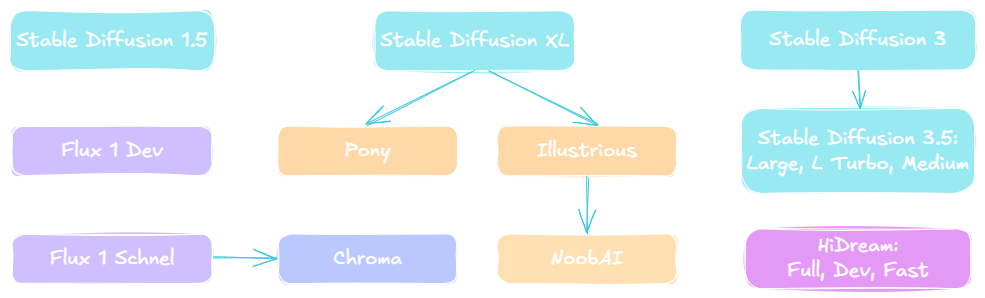
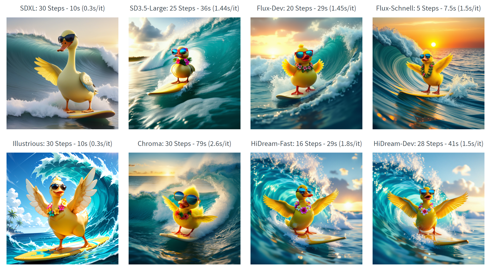

# Mastering Local AI Image Generation

## From Basics to Automation

---

# Agenda

- Key Technical Concepts in Image Generation
- Explore Open-Source Image Generation Models and Solutions to Run Locally
- Hands-on Implementation
  - Basic Image Generation with **LocalAI**
  - Advanced Image Generation with **ComfyUI**
  - Automate Image Generation with **n8n**

---

# Key Technical Concepts in Image Generation

- **Checkpoints**: The AI's "brain," a trained model's saved knowledge defining its capabilities and style.
- **Text Encoders**: Translate text prompts into a language the AI understands.
- **CLIP**: A smart AI that understands the visual meaning of text, connecting words to images.
- **LoRA**: Small, specialized additions that quickly change the image style or content (e.g., art styles, characters) without retraining the main model.
- **Positive Prompts**: Tell the AI what you want in the image.
- **Negative Prompts**: Tell the AI what to avoid (e.g., "blurry," "distorted," "low quality").
- **Samplers**: The AI's "sculpting techniques" for shaping the image.
  - **Euler a**: Fast with good quality.
  - **DPM++ 2M Karras**: Higher quality but slower.
  - **DDIM**: Good for consistent results across multiple generations.

---

# Explore Local Image Generation Models



---

# Comparing Model Performance and Quality

A bright **yellow duck**, wearing **oversized mirrored sunglasses** and a **tropical flower necklace**, balances expertly on a **surfboard**, cutting through the crest of an **enormous wave**. The water is a swirling mix of **blues and greens**, foamy spray **frozen in time** as it arcs around the duck’s **outstretched wings**. The horizon **stretches endlessly** in the background, where the **setting sun** casts a **golden glow** across the ocean’s surface.

(masterpiece, best quality, high quality, highres, absurdres, no humans, very aesthetic)

**Image Size:** 1024x1024



---

# Explore Local Image Generation Solutions

### [LocalAI](https://localai.io/)

- **Pros:**
  - All-in-one Gen AI: Supports text, image, audio, and transcription models.
  - Easy setup: Minimal configuration, includes a model gallery.
  - OpenAI-compatible API.
- **Cons:**
  - Less customization and control than specialized tools.
  - No video generation support yet.

### [ComfyUI](https://comfyui.win.ailogic.fr/)

- **Pros:**
  - Becoming the standard for image generation.
  - Visual node-based workflow creation.
  - Supports virtually all image and video generation models.
  - Strong community support.
- **Cons:**
  - Steeper learning curve; requires more technical knowledge.
  - No native support with n8n.

---

# LocalAI: Hands-on Implementation

### LocalAI Docker Compose

```yaml
docker-compose:
  services:
    localai:
      image: localai/localai:latest-gpu-nvidia-cuda-12
      container_name: localai
      environment:
        - MODELS_PATH=/models
      volumes:
        - localai:/models:cached
      deploy:
        resources:
          reservations:
            devices:
              - driver: nvidia
                count: all
                capabilities: [gpu]
      restart: unless-stopped
volumes:
  localai:
```

### Integrating with n8n

1. Create a new OpenAI credential: Set the Base URL to `http://localai:8080/v1`.
2. Extend the workflow from Phase 1:
   - Add an OpenAI node after the story generation nodes.
   - Select "Generate Image" as the action.
   - Use the scene from the previous phase as prompts.
   - Add negative prompts: "blurry, distorted, low quality, unrealistic, pixelated."

---

# ComfyUI: Hands-on Implementation

### Installation Options

- [Desktop Installer](https://www.comfy.org/download): The easiest way to get started.
- [Portable Package](https://github.com/comfyanonymous/ComfyUI/releases): Get the latest commits and completely portable.
- [Docker Container](https://github.com/YanWenKun/ComfyUI-Docker) (Community-Maintained): Isolates ComfyUI from the system.

### Integrating with n8n

1. From ComfyUI:
   - Enable Host Network in ComfyUI.
   - Enable dev mode options (API save, etc.).
   - Export ComfyUI Workflow JSON.
2. In n8n:
   - Install the [ComfyUI Community Node](https://www.npmjs.com/package/n8n-nodes-comfyui).
   - Add a ComfyUI node after the story generation nodes.
   - Paste the Workflow JSON into the ComfyUI node.
